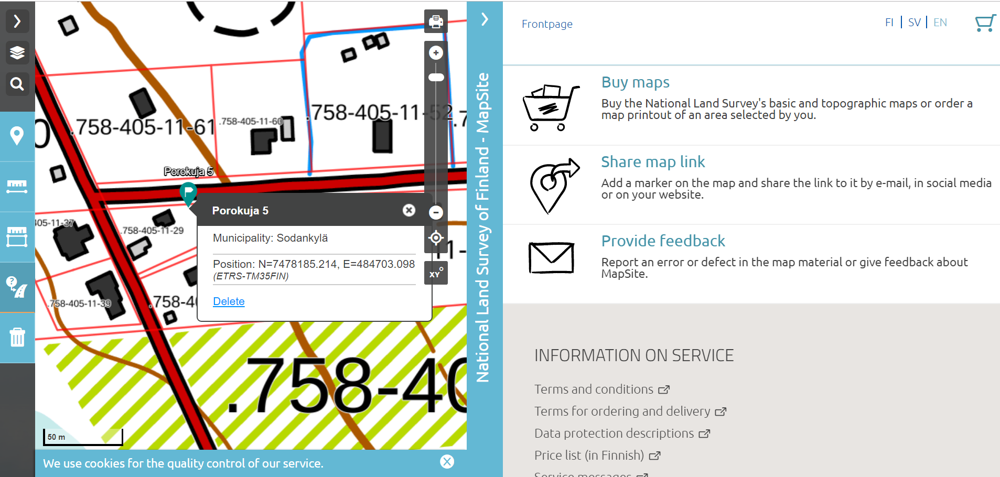

## NLS-FI Mapsite – worlds first national map service in the World Wide Web

The National Land Survey of Finland has been diligently enhancing their digital services for their customers and the [Mapsite (Karttapaikka)](https://asiointi.maanmittauslaitos.fi/karttapaikka/?lang=en) is one of the most used and oldest map services in Finland.

### It was first published already in 1996

At that time it was the world’s first national map service!
In the beginning there was no model for a user interface for a map service on the internet and the model had to be created within NLS-FI. They even went on and created an own format for map files so the administrators of the service could add new map images fast to the service. Since then the Mapsite has been renewed several times. The latest Oskari based service was published in 2016. It is also constantly being developed as part of the NLS-FI digital services.

In Mapsite you can do basic web-map functionalities, browse map layers, measure distances and search places by name or address. It is mainly used by citizens and land owners to check their plots and real estates but also by the Finnish GIS tribe since the Mapsite provides a very easy tool for defining the nearest address or define the coordinates of your whereabouts.

### Map prints are still needed
You can also buy maps from the service, although most of the datasets are also available as open data. The available map layers contain e.g. cadastral boundaries, hillshade, aerial images and topographic maps.

**Jaakko Viitala**, you are responsible for the development of the Mapsite. How many of your customers still need paper maps and is the services used a lot to order printouts

– _Interesting enough, it is still a very requested functionality. 
In 2018 there were almost 5 million visitors in the service (around 13 600 visits per day) and we sold 2730 print layouts and 7206 copies of prints!_

### The Mapsite is developed with Mobile First approach

– _It scales to mobile, tablet and desktop use, Viitala continues. 
It is so called single-page application that uses the users browser to access the server and database. 
The service is created with Oskari API with Suomi.fi-maps and also includes a lot of tailoring regarding the layout. 
From Suomi.fi -maps the Mapsite reaches datasets like basic map, background mapset and a plain map designed to people with seeing constraints.The Mapsite also fetches data straight from NLS-FI own interfaces._

Any future plans?

– _We would like to add continuous location possibility to the map, so that the location pointer would follow the user when for example doing field work. Also the user should be able to add own markings and POIs to the map._

 
